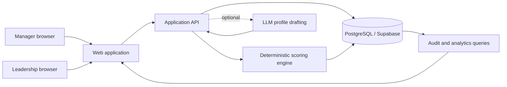
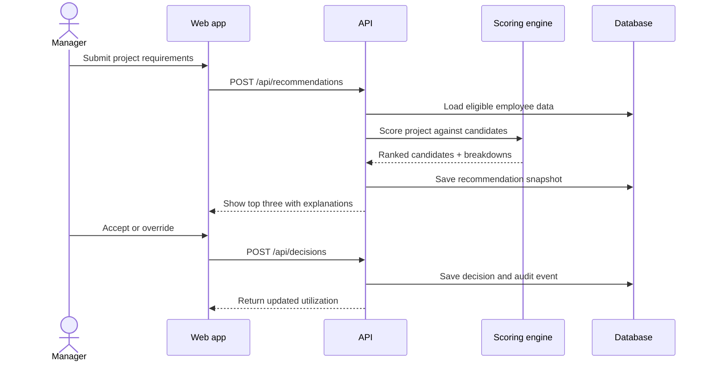

# System Architecture

## High-level architecture

## Design principle

Use deterministic code for ranking. Use an LLM only to draft structured work-style data from approved, sanitized work artifacts. This keeps allocation reproducible and prevents an unpredictable model from making staffing decisions.

## Components

### Web application

- Dashboard and project requirement form.
- Candidate comparison and score explanations.
- Override workflow and audit views.
- Recommended: Next.js with TypeScript.

### Application API

- Validates project and employee data.
- Calls the scoring engine.
- Stores recommendation snapshots and decisions.
- Enforces roles.

### Scoring engine

- Applies eligibility gates.
- Calculates skills, capacity, work-style, and distribution scores.
- Returns ranked candidates plus reason codes.
- Contains no hidden model state.

### Database

- Stores employees, skills, projects, allocations, recommendations, decisions, and audit events.
- Uses seeded synthetic data for the hackathon.

### Optional profile drafting service

- Accepts only approved and sanitized workplace artifacts.
- Returns strict JSON with confidence and evidence.
- Requires employee review before activation.
- Can be mocked if API access is unreliable.

## Core request flow

## Suggested API surface

| Method | Endpoint | Purpose |
|---|---|---|
| GET | `/api/dashboard` | Summary metrics |
| GET | `/api/employees` | Employee list and capacity |
| POST | `/api/projects` | Create a project |
| POST | `/api/recommendations` | Rank candidates |
| POST | `/api/decisions` | Accept or override |
| GET | `/api/audit` | Aggregate allocation and override analytics |
| POST | `/api/demo/reset` | Restore seeded demo state |

## Deployment

- Web/API: Vercel.
- Database: Supabase Postgres.
- Demo fallback: local JSON fixtures and browser storage.
- Secrets: server-side environment variables only.

## Failure behavior

- If the LLM is unavailable, use an employee-confirmed seeded work-style profile.
- If no employee passes all gates, explain the shortage and show the closest candidates without presenting them as valid recommendations.
- If the database is unavailable during judging, switch to the static demo fixture.

